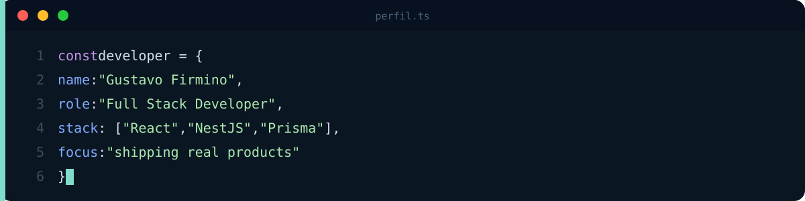

 

## Sobre

Trabalho como dev full stack na DMK3, no ITESP, um sistema web para projeto do governo de São Paulo. Curso Engenharia de Software na FIAP e me formo em 2029.

Passo a maior parte do tempo escrevendo API em NestJS com Prisma e Postgres, e tela em React com TanStack Query.

Fora disso treino PPL e jogo futebol ⚽

## Projetos

### ITESP · DMK3

Sistema web para um projeto do governo de São Paulo. Mexo no front (React com TanStack Query) e na API (NestJS, Prisma e TypeORM em cima do Postgres).

`React` `TanStack Query` `NestJS` `Prisma` `TypeORM` `PostgreSQL`

Repositório privado, o código é da [DMK3](https://github.com/dmk3-dev).

### [Trello Clone](https://github.com/gfirmino231-spec/Trello-Clone-with-auth-JWT)

Kanban com autenticação JWT completa (access + refresh token com rotação e detecção de reuso), drag & drop persistido no banco e cobertura de testes (10 unitários + 34 e2e).

`React` `TypeScript` `NestJS` `Prisma` `JWT` `Jest`

[Repositório](https://github.com/gfirmino231-spec/Trello-Clone-with-auth-JWT)

### [Meteora](https://github.com/gfirmino231-spec/Loja-Fullstack)

E-commerce de moda em monorepo. Front e back conversam só por GraphQL, sem REST.

`NestJS` `GraphQL` `Apollo` `Prisma` `PostgreSQL` `React 19` `Vite`

[Ver repositório](https://github.com/gfirmino231-spec/Loja-Fullstack)

### [OrbitWatch](https://github.com/gfirmino231-spec/OrbitWatch)

Monitoramento climático via satélite, feito para a Global Solution da FIAP. Tem uma parte edge em C++ que lê os sensores e manda os dados pro app.

`React` `Vite` `CSS Modules` `React Router` `C++`

[Demo](https://orbit-watch-wheat.vercel.app) · [Repositório](https://github.com/gfirmino231-spec/OrbitWatch) · [Camada edge](https://github.com/gfirmino231-spec/Orbitwatch-Edge-iot-)

<b>Mais projetos</b>

 

| Projeto | O que é | Stack |
|---|---|---|
| **[Cadastro de Usuários](https://github.com/gfirmino231-spec/Cadastro-de-usuarios)** | Cadastro e login de usuários | React · NestJS · Prisma · Supabase |
| **[Library System API](https://github.com/gfirmino231-spec/API-Restfull-w-Nest.js)** | API REST para gestão de biblioteca. O [front está aqui](https://github.com/gfirmino231-spec/Consumindo-api-com-react) | NestJS · TypeScript · class-validator |
| **[GourmetOn](https://github.com/gfirmino231-spec/Projeto-react-deploy)** | Landing de delivery, cardápio vem de uma API. [Demo](https://projeto-react-deploy.vercel.app) | React · Vite · Tailwind CSS |
| **[ProjetoApi](https://github.com/gfirmino231-spec/ProjetoApi)** | Front em React consumindo uma API Node que eu fiz. [Demo](https://projeto-api-five.vercel.app) | React · Vite · Node.js |

[Ver todos os repositórios](https://github.com/gfirmino231-spec?tab=repositories)

## Stack

<b>Ver por camada</b>

 

| Camada | Ferramentas |
|---|---|
| **Client** | React, TypeScript, Vite, TanStack Query, Apollo Client, Tailwind CSS |
| **API** | NestJS, Node.js, GraphQL, REST, JWT, class-validator |
| **Dados** | PostgreSQL, MySQL, Prisma, TypeORM, Supabase |
| **Infra** | AWS, Docker, Git, GitHub |

## Contato

Procurando vaga full stack ou backend. Me chama no LinkedIn.

  

